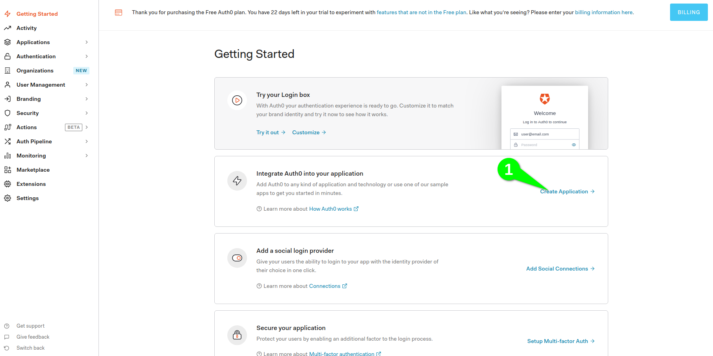
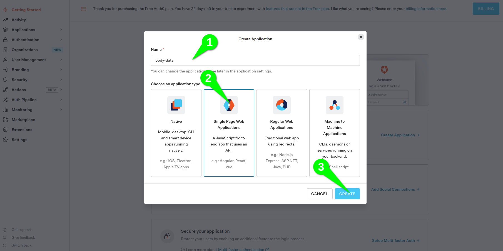
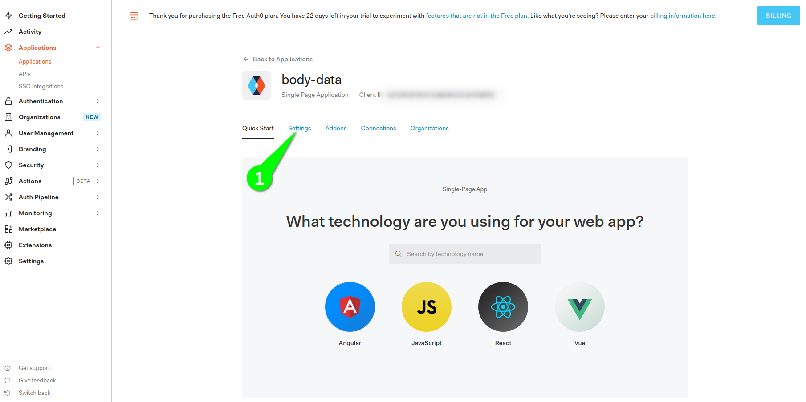
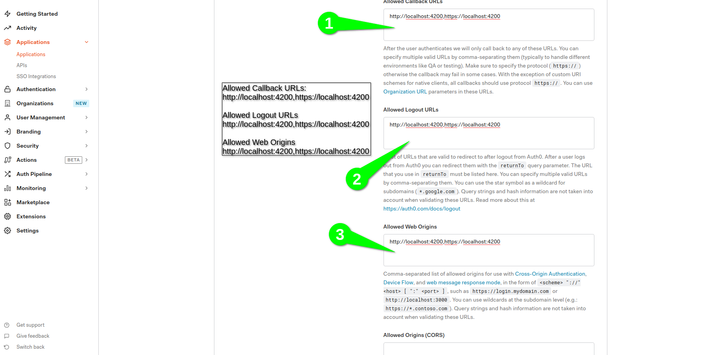

# AUTH0

integrazione autenticazione/oauth0

## prerequisiti

- prima di cominciare con la procedura, committare tutto, in modo da poter revertare in caso di errori.

## procedura

- registrarsi al sito https://auth0.com/
- creare una nuova configuraizone per l'applicazione seguendo i passaggi riportati nelle immagini






- eseguirre da terminale:

```
npm install @auth0/auth0-angular
```

- segui guide 

https://www.npmjs.com/package/@auth0/auth0-angular

https://offering.solutions/blog/articles/2021/02/01/using-auth0-in-angular-with-ngrx/#adding-the-actions

- sostituire i parametri (domain,audience,clientId) con quelli che abbiamo generato su https://manage.auth0.com/dashboard

- eseguirre da terminale:

```
npm install --save express-jwt jwks-rsa express-jwt-authz
```

- elimina da auth-store.module.js

```
AuthModule.forRoot({
      domain: '',
      clientId: '',
      redirectUri: window.location.origin,
    }),
```

- importa in app.module.ts

```
AuthModule.forRoot({
      domain: '',
      clientId: '',
      redirectUri: window.location.origin,
      // The AuthHttpInterceptor configuration
      httpInterceptor: {
        allowedList: [
          '/api',
          '/api/*',
        ],
      },
    }),
```

- aggiungi il seguente codice a server.js:

subito prima si const api

```
const cors = require('cors');
const jwt = require('express-jwt');
const jwksRsa = require('jwks-rsa');

const authConfig = {
  domain: '',
  audience: '',
  appUri: 'http://localhost:4200',
};

if (!authConfig.domain || !authConfig.audience) {
  throw 'Please make sure that auth_config.json is in place and populated';
}

const checkJwt = jwt({
  secret: jwksRsa.expressJwtSecret({
    cache: true,
    rateLimit: true,
    jwksRequestsPerMinute: 5,
    jwksUri: `https://${authConfig.domain}/.well-known/jwks.json`,
  }),

  audience: authConfig.audience,
  issuer: `https://${authConfig.domain}/`,
  algorithms: ['RS256'],
});
```

prima di server.use(api, middlewares);

```
server.use('/api/v2', checkJwt);
```

- a questo punto la nostra autenticazione funzionerà correttamente
